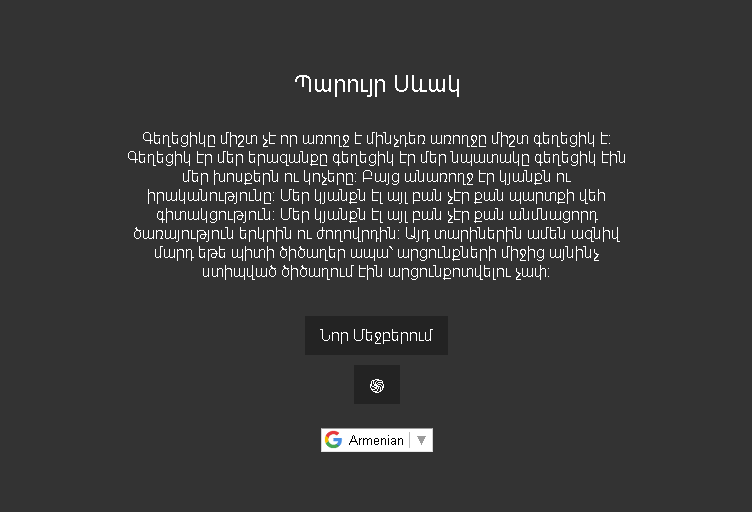

# PayrurQuote



PayrurQuote is a Python project that leverages Beautiful Soup and the Google Crawler library to fetch quotes by the famous Armenian poet, Payrur Sevak, from various sources on the internet. The fetched quotes undergo a review process and are stored in a MariaDB database. This database is then accessed by a PHP MVC API, which is part of a LEMP stack (Linux, Nginx, MariaDB, PHP).

## Requirements
- Python 3.x
- BeautifulSoup
- Google Crawler library
- requests
- MariaDB
- LEMP Stack (Linux, Nginx, MariaDB, PHP)

## Installation

1. Clone the repository:
```bash
   git clone https://github.com/kevsiraki/PayrurQuote
   cd PayrurQuote
```
2. Install the required Python packages:
```bash
   pip install beautifulsoup4 googlesearch-python requests
```
3. Ensure that MariaDB is installed and configured.
4. Set up the PHP MVC API on your Nginx/Apache host.

## API Usage

The API routes are as follows:

- `quotes/`: Fetches all quotes.
- `quotes/<id>`: Fetches a single quote by ID.
- `quotes/random`: Fetches a single random quotes.

The frontend provides a simple UI with the following features:

Dark mode
Translation option
Button to fetch a new quote

## File Structure
- `crawler.py`: Python script to fetch and extract quotes.
- `backend`: PHP backend for the web application.
- `client`: HTML/CSS/JS vanilla frontend files.

## Database Schema

The MariaDB database should have a Quotes table with the following columns:

`id`: (int pri auto_incremented)
`quote`: (text)